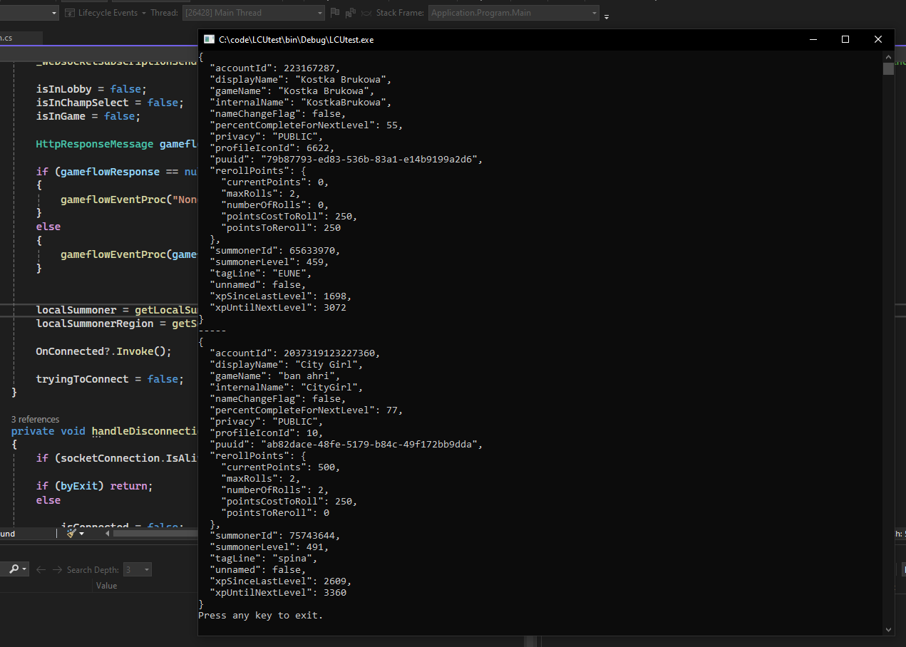

# soulspine/LCU

# THIS HAS BEEN ABANDONED AND WILL NOT BE UPDATED ANYMORE
Check out branch v2 for current version. Everything said down below is still valid for this version. There is no reason to use it though because it forces you to use .NET Framework and it's very messy, whereas v2 works on both Framework and Core.

## League of Legends Client API handler for C# (.NET Framework 4.8.1)

This class is a wrapper for the League of Legends Client API. It is designed to be used in C# applications that require interaction with the League of Legends client. Works only on Windows. Heavily inspired by [PoniLCU](https://github.com/Ponita0/PoniLCU). If you want to use it, just download the .cs file and include it in your project with `using soulspine.LCU;`.

## Requirements
- .NET Framework 4.8.1 (maybe works on other versions, but I haven't tested it)
- [Newtonsoft.Json](https://www.nuget.org/packages/Newtonsoft.Json/) (built on version 13.0.3)
- [WebSocketSharp](https://www.nuget.org/packages/WebSocketSharp/) (built on version 1.0.3-rc11)

# Endpoints
For help on endpoints and events occuring in the client, check out [LCU Explorer](https://github.com/HextechDocs/lcu-explorer) and you can look at the [help.json](help.json) file containing every event and a lot of endpoints - if you want to get endpoint for an event, they follow the same pattern, for example `/lol-gameflow/v1/gameflow-phase` is the endpoint for `OnJsonApiEvent_lol-gameflow_v1_gameflow-phase`, but remember that not every endpoint has a corresponding event

# Initiating an object and connecting
When initiating a `LeagueClient` object, you can pass a `bool` `autoReconnect` parameter to the constructor, which defines whether the client should automatically reconnect after a disconnection. By default it is set to `true`. Regardless of its value, first connection always has to be done using the `.Connect()` method. This creates an asynchronous task trying to connect, so I would recommend to wait for it to establish connection before you continue by checking the `isConnected` value. You can always disconnect using the `.Disconnect()` method.
```cs
var lcu = new LeagueClient();
lcu.Connect();

while (!lcu.isConnected) { } //wait for connection

// rest of the code
```

## Features
### Sending requests to the League of Legends client - `.request()`

Using `.request()` method, you can send requests to the League of Legends client. The awaited method returns a `HttpResponseMessage` object if it could be sent, otherwise it returns `null`. Because it is a `Task` object, you need to use `await` or `.Result` to get the proper response.

#### Parameters:
- `method` enum of `requestMethod` type - defines the request method (GET, POST, PATCH, DELETE, PUT)
- `endpoint` string - defines the endpoint of the request, see [Endpoints](#endpoints) for more information
- `data` **(optional)** dynamic type - defines the body of the request, it gets serialized automatically
- `ignoreReadyCheck` **(optional)** bool - whether it should skip checking if the client is properly connected and send the request either way (default is `false`)

#### Exceptions:
- `InvalidOperationException` - thrown when the client is not connected yet, can be overriden by setting `ignoreReadyCheck` to `true`
- `HttpRequestException` - thrown when the request could not be sent

#### Example usage:
```cs
using soulspine.LCU;
using System.Net.Http;
using System;

namespace Application
{
    internal class Program
    {
        private static void Main(string[] args)
        {
            LeagueClient lcu = new LeagueClient();

            lcu.Connect();

            while (!lcu.isConnected) { } //wait for connection

            HttpResponseMessage response = lcu.request(requestMethod.GET, "/lol-summoner/v1/current-summoner").Result;
            Console.WriteLine(response.Content.ReadAsStringAsync().Result);

            Console.WriteLine("Press any key to exit");
            Console.ReadKey();
        }
    }
}
```


### Subscribing to and unsubscribing from events happening in the client - `.Subscribe()` and `.Unsubscribe()`

Using `.Subscribe()` and `.Unsubscribe()` methods, you can bind actions to events incoming from specified endpoints in the League of Legends client. Those actions stay bound until you remove them, they are not lost on disconnection.

#### Parameters for `.Subscribe()`:
- `endpoint` string - defines the path of the event
- `action` Action\<OnWebsocketEventArgs> - defines the action that should be executed when the event occurs

#### Parameters for `.Unsubscribe()`:
- `endpoint` **(optional)** string - defines the path of the event, if not specified, all events will be removed
- `action` **(optional)** Action\<OnWebsocketEventArgs> - defines the action that should be removed from the event, if not specified, all actions bound to the event will be removed

#### Exceptions:
- `InvalidOperationException` - thrown when you either try to bind an action to an event that is already bound or try to remove an action that is not bound

#### Example usage (note that if you want to use LeagueClient object in the action, you need to initiate it as a static variable in the class):
```cs
using soulspine.LCU;
using System;
using Newtonsoft.Json;

namespace Application
{
    internal class Program
    {
        static LeagueClient lcu = new LeagueClient(); //static

        private static void Main(string[] args)
        {
            lcu.Subscribe("lol-gameflow/v1/gameflow-phase", OnGameflowStateChanged);

            lcu.Connect();

            while (!lcu.isConnected) { } //wait for connection

            Console.WriteLine("Press any key to exit.");
            Console.ReadKey();
        }

        private static void OnGameflowStateChanged(OnWebsocketEventArgs e)
        {
            Console.WriteLine(JsonConvert.SerializeObject(e.Data));
        }
    }
}
```


### Getting summoner data - `.GetSummoner()` and `.GetSummoners()`

Using `.GetSummoner()` and `.GetSummoners()` methods, you can get data about summoners in the client. The awaited method returns a `Summoner` object if it could be fetched, otherwise it returns `null` or an empty list. 

#### Parameters for `.GetSummoner()`:
- `name` **(optional)** string - summoner name, if not specified, it will get data about the current summoner
- `tagline` **(optional)** string - summoner tagline, if not specified, it will get data about the current summoner

#### Parameters for `.GetSummoners()`:
- `tupList` List\<Tuple\<string, string>> - list of tuples containing summoner name and tagline - for example `new List<Tuple<string, string>> { new Tuple<string, string>("Kostka Brukowa", "EUNE"), new Tuple<string, string>("ban ahri", "spina") }`

#### Example usage:
```cs
using soulspine.LCU;
using System;
using Newtonsoft.Json;

namespace Application
{
    internal class Program
    {
        static LeagueClient lcu = new LeagueClient();

        private static void Main(string[] args)
        {
            lcu.Connect();

            while (!lcu.isConnected) { } //wait for connection

            Summoner summoner = lcu.GetSummoner("Kostka Brukowa", "EUNE");
            Console.WriteLine(JsonConvert.SerializeObject(summoner, Formatting.Indented));

            Console.WriteLine("-----");

            summoner = lcu.GetSummoner();
            Console.WriteLine(JsonConvert.SerializeObject(summoner, Formatting.Indented));

            Console.WriteLine("Press any key to exit.");
            Console.ReadKey();
        }
    }
}
```



### Built-in events and variables
LeagueClient class h a few built-in events that you can bind actions to. Those musn't have any arguments. Available events are:
- `OnConnected` - occurs when the client is connected
- `OnDisconnected` - occurs when the client is disconnected
`OnLobbyEnter` - occurs when the client enters a lobby
- `OnLobbyLeave` - occurs when the client exits a lobby
- `OnChampSelectEnter` - occurs when the client enters a champion select
- `OnChampSelectLeave` - occurs when the client exits a champion select
- `OnGameEnter` - occurs when the client enters a game
- `OnGameLeave` - occurs when the client exits a game

There are also a few built-in variables that are updated automatically on their events and you can access:
- `isConnected` bool - defines whether the client is connected
- `isInLobby` bool - defines whether the client is in a lobby
- `isInChampSelect` bool -  defines whether the client is in champion select
- `isInGame` bool - defines whether the client is in a game
- `localSummoner` Summoner - defines the current summoner
- `localSummonerRegion` string - defines the region of the current summoner
- `currentGameflowPhase` string - defines the current gameflow phase *(None, Lobby, ChampSelect, Matchmaking, ReadyCheck, InProgress, PostGame)*

#### Example usage:
```cs
using soulspine.LCU;
using System;

namespace Application
{
    internal class Program
    {
        static LeagueClient lcu = new LeagueClient(autoReconnect: false);

        private static void Main(string[] args)
        {
            lcu.OnConnected += OnConnected;
            lcu.OnDisconnected += OnDisconnected;

            while (true) 
            {
                Console.ReadKey();
                if (lcu.isConnected) lcu.Disconnect();
                else lcu.Connect();
            }
        }

        private static void OnConnected()
        {
           Console.WriteLine($"Connected to LCU as {lcu.localSummoner.gameName}#{lcu.localSummoner.tagLine} - {lcu.localSummonerRegion}");
        }

        private static void OnDisconnected()
        {
            Console.WriteLine("Disconnected from LCU.");
        }
    }
}
```

